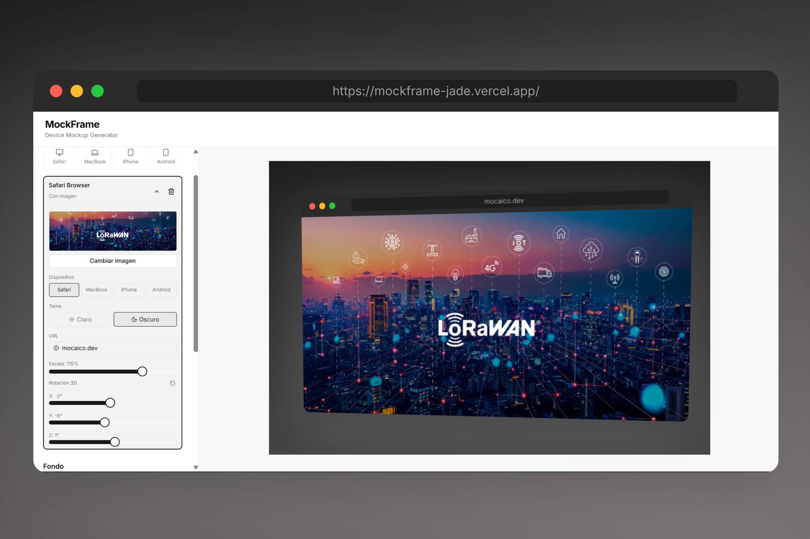

# MockFrame — Device Mockup Generator



Genera imágenes de presentación profesionales colocando tus capturas de pantalla dentro de marcos de dispositivos reales — navegador Safari, MacBook, iPhone 15 y Android Pixel — con fondos personalizados, transformaciones 3D y exportación en alta resolución.


---

## Características

- **4 dispositivos** — Safari Browser, MacBook, iPhone 15, Android Pixel
- **Capas múltiples** — añade, reordena y posiciona dispositivos en el mismo canvas
- **Drag & drop** — mueve cada dispositivo libremente sobre el canvas
- **Transformaciones 3D** — controla escala, rotación en X/Y/Z y perspectiva
- **Fondo personalizable** — color sólido o gradiente con presets y selector de dirección
- **Sombra adaptativa** — sombra oscura en fondos claros, clara en fondos oscuros, con control de intensidad
- **Exportación PNG / SVG** a 3× de resolución (pixel-perfect para presentaciones y redes sociales)

---

## Inicio rápido

```bash
# Requiere Node.js >= 18.17.0
npm install
npm run dev
```

Abre [http://localhost:3000](http://localhost:3000).

---

## Uso

1. **Añade un dispositivo** desde el panel lateral (Safari, MacBook, iPhone, Android).
2. **Sube una imagen** haciendo clic en el área del dispositivo.
3. **Ajusta posición** arrastrando el dispositivo en el canvas, o con los controles de rotación y escala.
4. **Elige un fondo** — sólido, gradiente con presets o colores personalizados.
5. **Regula la sombra** con el slider de intensidad.
6. **Exporta** en PNG o SVG con el botón de la barra lateral.

---

## Stack

| Tecnología | Uso |
|---|---|
| Next.js 14 (App Router) | Framework principal |
| React 18 | UI y estado |
| TypeScript 5 | Tipado |
| Tailwind CSS 3 | Estilos |
| shadcn/ui + Radix UI | Componentes (Slider, Tabs) |
| html-to-image | Exportación canvas → PNG/SVG |
| lucide-react | Iconos |

---

## Licencia

MIT
